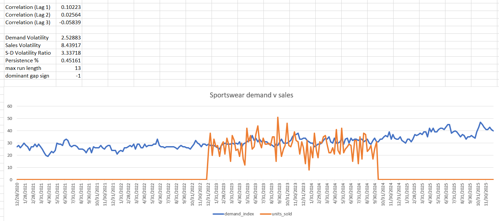
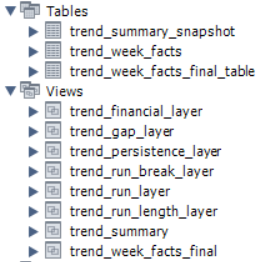

# Trend-Driven Retail Demand Allocation Analysis

## Overview

Retail organizations often react to sales volatility as if it reflects demand volatility. However, fluctuations in sales can arise from operational execution issues, inventory allocation decisions, or planning bias rather than changes in customer demand.

This project combines Google Trends demand signals with apparel sales data to investigate whether observed sales patterns reflect true demand changes or demand–supply misalignment.

Using Excel and SQL, a structured analytical framework was built to:

- Compare demand and sales behavior at a weekly trend level
- Measure persistence of demand–sales gaps
- Distinguish execution noise from structural planning issues
- Quantify the relative financial impact of persistent misalignment

---

## Tools Used

- Excel
- MySQL
- Google Trends
- Kaggle Dataset

---

## Business Problem

**How can we distinguish temporary execution issues from systematic planning failures when demand and sales diverge over time?**

More specifically:

- Are sales fluctuations driven by customer demand?
- Are demand signals being consistently under-served?
- Which trends create the greatest financial risk when misalignment persists?

---

## Data Sources

### Demand Signals

Google Trends weekly search interest data:

- Sportswear
- Cargo Pants

Additional trend data collected for future analysis:

- Oversized T-Shirt
- Co-ord Set

### Sales Data

Apparel sales dataset sourced from Kaggle.

Sales data was available from:

**26-Dec-2022 to 07-Oct-2024**

Google Trends data covered a longer period but analysis was restricted to weeks where both demand and sales data were available.

---

## Data Integration Challenges

Demand and sales data originated from different sources and did not share a common category structure.

To address this, a trend-to-sales mapping framework was created:

| Trend | Sales Category | Mapping Strength |
|---------|---------|---------|
| Sportswear | Sportswear | Strong |
| Oversized T-Shirt | T-Shirts | Strong |
| Cargo Pants | Jeans | Medium |
| Co-ord Set | Women's Dresses | Weak |

This mapping layer allowed demand signals to be connected to corresponding sales categories while explicitly acknowledging uncertainty in category alignment.

---

## Analytical Framework

The project follows a four-step analytical process:

### 1. Volatility Analysis

Compare demand volatility against sales volatility.

Purpose:

- Identify whether sales fluctuate more than customer interest.

### 2. Lag Correlation Analysis

Evaluate whether sales respond to demand signals after a delay.

Purpose:

- Detect timing mismatches between demand and fulfillment.

### 3. Demand–Sales Gap Analysis

Measure weekly differences between demand signals and realized sales.

Purpose:

- Identify under-fulfillment and over-fulfillment patterns.

### 4. Persistence Analysis

Determine whether misalignment is temporary or persistent.

Purpose:

- Separate execution noise from structural planning issues.



---

## Excel Workflow

The analysis was initially developed in Excel using the following workflow:

1. Import Google Trends demand data
2. Import apparel sales data
3. Aggregate sales to weekly level
4. Create trend-to-category mappings
5. Build trend-specific demand vs sales analysis sheets
6. Compute volatility metrics
7. Calculate lag correlations
8. Generate demand–sales gap metrics
9. Measure persistence and run-length behavior
10. Design financial impact framework

Workbook Structure:

- demand_raw
- sales_raw
- sales_weekly_agg
- trend_sales_map
- sportswear_dvs
- cargo_dvs
- module_3_design
- trend_week_facts
- module_3_metrics
- final_outputs

---

## SQL Analytics Pipeline

The Excel logic was rebuilt in MySQL using a layered analytics architecture.



### Layer 1 — Gap Detection

`trend_gap_layer`

Creates:

- gap_units
- gap_sign

### Layer 2 — Persistence Detection

`trend_persistence_layer`

Creates:

- persistence_flag

Using:

```sql
LAG()
```

### Layer 3 — Run Break Identification

`trend_run_break_layer`

Detects changes in gap direction.

### Layer 4 — Run Tracking

`trend_run_layer`

Creates:

- run_id

### Layer 5 — Run Length Calculation

`trend_run_length_layer`

Creates:

- run_length

### Layer 6 — Financial Impact Estimation

`trend_financial_layer`

Creates:

- asp
- lost_revenue
- markdown_loss

### Layer 7 — Executive Summary

`trend_summary`

Produces trend-level KPIs including:

- Total Financial Impact
- Maximum Run Length
- Persistence Rate

---

## Financial Impact Framework

Because Google Trends provides normalized demand signals rather than unit demand, all financial calculations are treated as relative risk estimates rather than actual revenue forecasts.

### Assumptions

Sportswear ASP = ₹1,500

Cargo Pants ASP = ₹2,000

Markdown Rate = 30%

### Metrics

#### Revenue Loss from Under-Fulfillment

Estimated opportunity loss when demand exceeds sales.

#### Margin Risk from Overstock

Estimated markdown exposure when sales exceed demand.

#### Persistence-Weighted Financial Risk

Combines:

- Financial magnitude
- Frequency of misalignment
- Duration of persistent gaps

---

## Key Findings

### Sportswear

| Metric | Value |
|----------|----------|
| Total Financial Impact | ₹812,100 |
| Persistence Rate | 46.8% |
| Maximum Run Length | 7 Weeks |

Interpretation:

Sales volatility was significantly higher than demand volatility, suggesting operational execution noise rather than structural demand issues.

---

### Cargo Pants

| Metric | Value |
|----------|----------|
| Total Financial Impact | ₹6,202,000 |
| Persistence Rate | 98.9% |
| Maximum Run Length | 94 Weeks |

Interpretation:

Demand consistently exceeded realized sales over an extended period.

This pattern indicates a structural planning or allocation issue rather than episodic execution problems.

| Trend | Total Financial Impact | Persistence Rate | Max Run Length |
|---------|---------:|---------:|---------:|
| Sportswear | ₹812,100 | 46.8% | 7 |
| Cargo Pants | ₹6,202,000 | 98.9% | 94 |


---

## Final Insight

> Cargo Pants generated over 8× the financial impact of Sportswear despite lower sales volatility. The misalignment persisted for 94 consecutive weeks, suggesting structural demand suppression rather than operational execution noise.

---

## Business Recommendations

### Sportswear

Risk Type:

- Execution Volatility

Primary Driver:

- Fulfillment / Allocation Noise

Recommended Action:

- Improve fulfillment consistency
- Stabilize operational execution

### Cargo Pants

Risk Type:

- Structural Revenue Loss

Primary Driver:

- Planning Bias

Recommended Action:

- Revisit demand planning assumptions
- Increase allocation responsiveness to trend signals

---

## Limitations

This project intentionally acknowledges several real-world constraints:

- Google Trends measures search interest rather than actual demand
- Sales and demand data originated from separate sources
- Category mappings contain varying levels of confidence
- Financial calculations are relative impact estimates rather than actual revenue forecasts

Findings should be interpreted within the context of these data and mapping limitations.

---


## Skills Demonstrated

- Data Cleaning
- Data Integration
- Data Wrangling
- Exploratory Data Analysis
- SQL Window Functions
- KPI Development
- Persistence Analysis
- Business Analysis
- Financial Impact Modeling
- Data Storytelling

---
